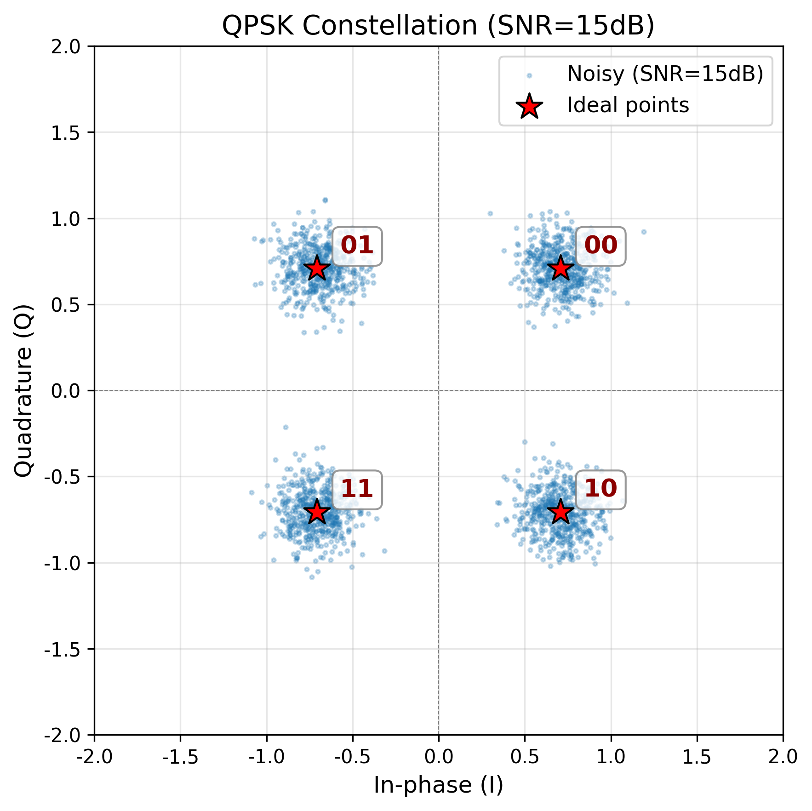
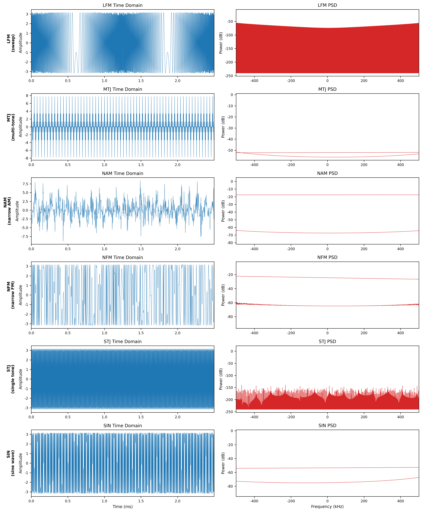
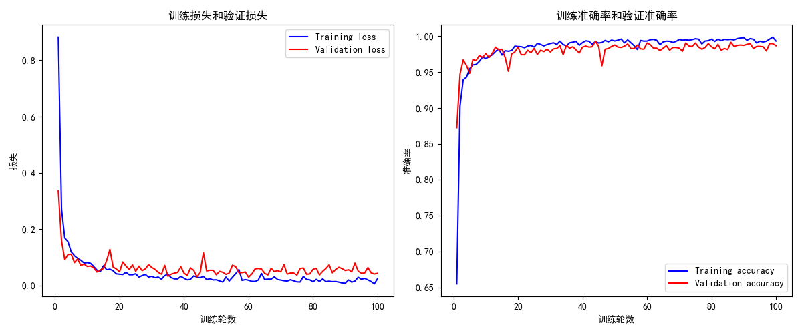
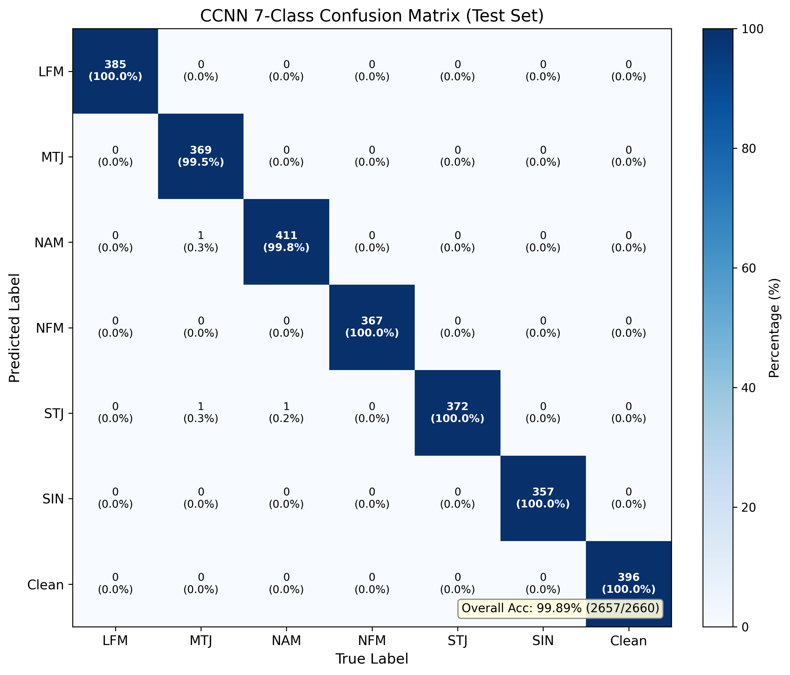
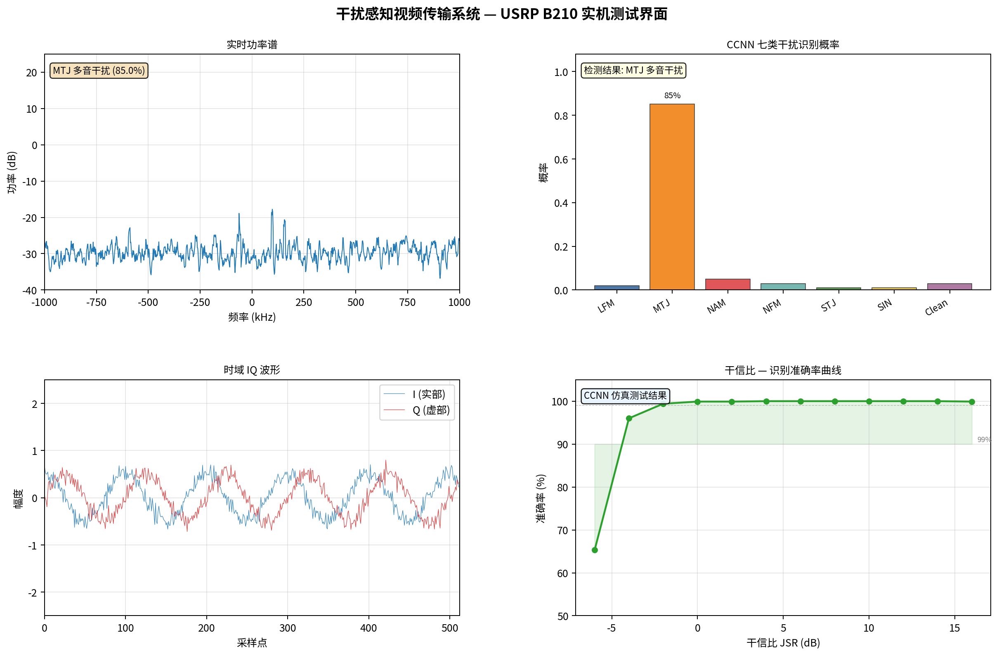

# 面向信号干扰检测与识别的视频传输平台开发

**Interference-Aware Adaptive Video Transmission Platform Based on CCNN**

---

**学    院**：信息与通信工程学院

**专    业**：通信工程（卓越）

**学生姓名**：李智杰

**班级/学号**：通信2201 / 2022010843

**指导教师**：刘磊

**起止时间**：2026年2月23日 至 2026年5月20日

---

## 摘要

在现代无线通信系统中，电磁干扰是影响通信质量的关键因素之一。通信方对干扰信号的类型进行准确识别与实时感知，对于采取有效的抗干扰策略具有重要意义。本文设计并实现了一套完整的干扰感知自适应视频传输系统，能够实时检测并识别通信信道中的干扰信号类型，并据此动态调整传输参数以最大化视频传输质量。

本文的主要工作和贡献如下：

（1）**设计并训练了基于复合卷积神经网络（CCNN）的7类干扰识别模型**。该模型融合CNN特征提取、SE通道注意力机制、残差网络和多头因果注意力机制，能够对扫频干扰（LFM）、多音干扰（MTJ）、窄带调幅（NAM）、窄带调频（NFM）、单音干扰（STJ）、正弦波（SIN）6类干扰信号及正常信号进行准确分类。模型总参数量96,921，在干信比（JSR）≥0dB条件下，识别准确率达到99.9%，且误报率为0%。在JSR=-2dB条件下准确率仍达99.4%。

（2）**设计并实现了完整的自适应视频传输系统**。系统涵盖了从视频采集、JPEG编码、自定义帧结构分包、FEC前向纠错编码、QPSK调制到信道传输、AGC自动增益控制、载波频偏校正、解调解码、视频显示的完整链路。系统根据CCNN检测到的干扰类型和置信度，通过多级滞后计数器机制动态调整JPEG编码质量（15~85）、FEC冗余度（1~3倍）和视频帧率（5~25fps），实现干扰环境下的传输参数自适应优化。

（3）**基于USRP B210软件无线电平台完成了硬件在环验证**。通过仿真模式和实机模式的双重测试，验证了系统的完整性和实用性。系统在两种模式下均能稳定运行，干扰检测有效，自适应策略正确切换。

（4）**开发了实时可视化面板**，基于matplotlib实现频谱图、CCNN概率柱状图、时域波形和JSR精度曲线的实时展示，便于系统状态监测和演示。

**关键词**：干扰识别；卷积神经网络；自适应传输；软件无线电；USRP B210

---

## Abstract

In modern wireless communication systems, electromagnetic interference is one of the key factors affecting communication quality. Accurate identification and real-time perception of interference signal types is of great significance for adopting effective anti-jamming strategies. This thesis designs and implements a complete interference-aware adaptive video transmission system that can detect and identify interference signal types in communication channels in real time, and dynamically adjust transmission parameters to maximize video transmission quality.

The main contributions of this thesis are as follows:

(1) A 7-class interference identification model based on Composite Convolutional Neural Network (CCNN) is designed and trained. The model integrates CNN feature extraction, SE channel attention mechanism, residual network, and multi-head causal attention mechanism. With only 96,921 parameters, it achieves 99.9% accuracy at JSR ≥ 0dB with 0% false positive rate, and 99.4% at JSR = -2dB.

(2) A complete adaptive video transmission system is designed and implemented, covering the full pipeline from video capture, JPEG encoding, custom framing, FEC encoding, QPSK modulation to channel transmission, AGC, CFO correction, demodulation, decoding, and video display. A multi-level hysteresis counter mechanism ensures stable adaptive switching.

(3) Hardware-in-the-loop verification is completed based on the USRP B210 software-defined radio platform through both simulation and real-world modes.

(4) A real-time visualization dashboard is developed for system monitoring and demonstration.

**Keywords**: Interference Identification; Convolutional Neural Network; Adaptive Transmission; Software-Defined Radio; USRP B210

---

## 目录

- [第一章 绪论](#第一章-绪论)
- [第二章 系统相关技术](#第二章-系统相关技术)
- [第三章 系统总体设计](#第三章-系统总体设计)
- [第四章 干扰识别模型设计与实现](#第四章-干扰识别模型设计与实现)
- [第五章 视频传输系统设计与实现](#第五章-视频传输系统设计与实现)
- [第六章 系统测试与实验分析](#第六章-系统测试与实验分析)
- [第七章 总结与展望](#第七章-总结与展望)
- [参考文献](#参考文献)
- [致谢](#致谢)

---

## 第一章 绪论

### 1.1 研究背景与意义

随着无线通信技术的快速发展，电磁环境日益复杂。在军事通信、应急通信和民用通信等领域，通信系统面临各种类型的故意或无意干扰威胁。这些干扰可能导致通信质量严重下降甚至通信中断，对信息安全传输构成重大威胁。

传统的干扰检测方法主要基于功率谱密度（PSD）分析、统计特征提取等信号处理技术，通过设定固定阈值进行干扰判决。这类方法虽然在特定条件下有效，但存在以下局限性：（1）依赖人工特征设计，泛化能力有限；（2）难以区分不同类型的干扰信号；（3）对低干信比（JSR）条件下干扰检测灵敏度不足。

近年来，深度学习技术在信号识别领域展现出强大能力。卷积神经网络（CNN）能够自动学习信号的特征表示，在调制识别、信号分类等任务中取得了显著优于传统方法的性能。将深度学习应用于干扰检测与识别，能够实现更高精度的干扰类型判别，为后续的自适应抗干扰策略提供更精确的决策依据。

### 1.2 国内外研究现状

#### 1.2.1 干扰信号检测与识别

在干扰检测领域，国内外学者已开展了大量研究。Pirayesh和Zeng系统综述了无线网络中的干扰攻击与抗干扰策略，对基于功率谱特征的检测方法进行了全面梳理，指出自适应阈值方案在应对时变干扰时的有效性[4]。基于功率谱幅值分布、谱熵等统计特征的检测方法因其计算复杂度低而得到广泛应用，但在低干信比条件下检测灵敏度不足，且难以区分干扰类型。

在干扰识别领域，深度学习方法的引入显著提升了识别精度。O'Shea等人最早验证了CNN在无线信号分类任务中的有效性，将IQ信号直接作为网络输入，证明了端到端深度学习方法的可行性，奠定了基于深度学习的信号识别研究基础[3]。Zhang等人提出了CNN与Transformer相结合的干扰识别网络，充分利用了CNN局部特征提取和Transformer全局依赖建模的互补优势，在多种干扰类型上取得了优于纯CNN方法的性能[6]。Xu等人提出了基于时频分析的深度干扰分类方法，用于跳频系统的干扰识别，通过时频图变换将一维信号分类转化为二维图像分类问题[7]。Guo等人研究了基于深度学习的干扰信号特征提取与模式分类算法，验证了注意力机制在干扰识别中的有效性[9]。Li等人将深度学习应用于跳频信号的自动调制识别，展示了CNN在复杂电磁环境下的泛化能力[10]。

在国内研究方面，王志勤等人对6G移动通信系统中的关键技术挑战进行了展望，指出智能抗干扰将是未来通信系统的重要能力[1]。张平等人进一步分析了6G场景下通信与人工智能融合的技术路径[2]。

#### 1.2.2 软件无线电平台应用

软件无线电（SDR）技术为干扰检测与识别算法的工程验证提供了灵活的硬件载体。USRP作为成熟的软件无线电硬件平台，已被广泛应用于通信干扰检测与信号处理研究。Manco等人的综述表明，基于SDR的频谱感知技术在认知无线电领域具有重要的应用价值，USRP平台的高采样率和宽频率范围使其成为实时信号处理的理想工具[8]。在实际应用中，基于USRP的通信系统验证平台能够实现从算法仿真到硬件在环测试的无缝衔接，加速了干扰检测算法的工程化进程。

#### 1.2.3 自适应传输技术

自适应传输技术通过动态调整传输参数来适应信道条件变化。在干扰环境下，自适应策略通常包括调整调制方式、编码速率、发射功率等参数。Proakis[15]和Goldsmith[16]在其经典著作中系统论述了自适应调制编码（AMC）的理论基础，指出基于信道状态信息（CSI）的自适应传输能够在保证服务质量的前提下最大化频谱效率。已有研究表明，结合实时信道感知的自适应传输能够显著提高系统在恶劣信道条件下的传输可靠性。本文将干扰类型识别结果作为信道状态信息，通过调整应用层参数（JPEG质量、FEC冗余度、帧率）实现干扰环境下的传输优化。

### 1.3 本文主要工作

本文设计并实现了一套完整的干扰感知自适应视频传输系统，主要工作包括：

1. **干扰识别模型设计**：基于复合卷积神经网络（CCNN），融合CNN、SE注意力、残差网络和多头因果注意力，实现7类信号（6类干扰+正常信号）的准确分类。

2. **训练数据生成**：分别基于MATLAB和Python实现了6种干扰信号的生成器，构建了包含13,300个样本（7类）的宽干信比训练数据集。

3. **视频传输系统实现**：设计了完整的TX/RX链路，包括JPEG编码、自定义帧结构分包、FEC编码、QPSK调制解调（含RRC脉冲成形、前导序列同步、CFO估计校正、AGC）等功能模块。

4. **自适应传输策略**：根据CCNN的实时检测结果，动态调整JPEG质量、FEC冗余度和帧率，实现干扰环境下的传输参数优化。

5. **硬件在环验证**：基于USRP B210完成端到端实机测试，验证系统实用性。

6. **实时可视化**：开发matplotlib可视化面板，实时展示系统运行状态。

### 1.4 论文组织结构

本文共分为七章。第一章为绪论，介绍研究背景和现状；第二章介绍系统涉及的关键技术；第三章给出系统总体设计方案；第四章详细描述CCNN干扰识别模型的设计与训练；第五章阐述视频传输系统的实现细节；第六章给出系统测试与实验分析；第七章总结全文并展望未来工作。

---

## 第二章 系统相关技术

### 2.1 软件无线电与USRP B210

软件无线电（Software-Defined Radio, SDR）是一种通过软件实现无线电通信系统大部分功能的技术方案。与传统的硬件无线电相比，SDR具有灵活性高、可重构性强、开发周期短等优势。

USRP（Universal Software Radio Peripheral）是由Ettus Research公司开发的一系列软件无线电外设。本文使用的USRP B210是一款高性能、低成本的SDR平台，其主要特性如下：

| 参数 | 规格 |
|------|------|
| 频率范围 | 70 MHz ~ 6 GHz |
| 通道数 | 2×2 MIMO |
| 采样率 | 最高 61.44 MSps |
| 带宽 | 最高 56 MHz |
| 分辨率 | 12-bit ADC / 14-bit DAC |
| 接口 | USB 3.0 |
| FPGA | Xilinx Spartan-6 |

系统通过UHD（USRP Hardware Driver）驱动程序控制USRP B210，使用Python绑定接口实现参数配置和数据收发。

### 2.2 QPSK调制解调

四相位移键控（Quadrature Phase Shift Keying, QPSK）是一种常用的数字调制方式，每个符号携带2比特信息。QPSK通过在I（同相）和Q（正交）两个正交载波上各传输1比特数据，实现每符号2比特的传输效率。

本系统采用根升余弦（Root Raised Cosine, RRC）脉冲成形滤波器，滚降系数为0.35，符号率为500 ksym/s，采样率为2 MHz（每符号4个采样点），数据传输速率为1 Mbps。



### 2.3 卷积神经网络

卷积神经网络（Convolutional Neural Network, CNN）是深度学习中最成功的网络结构之一。CNN通过卷积层提取输入数据的局部特征，通过池化层降低特征维度，通过全连接层实现分类决策。CNN在图像识别、语音处理和信号分类等领域均有广泛应用。

一维卷积神经网络（1D-CNN）适用于时序信号的特征提取。本系统中，CCNN模型使用1D-CNN处理IQ双通道信号（实部和虚部），提取信号的时域特征用于干扰类型分类。

### 2.4 注意力机制

#### 2.4.1 SE通道注意力

SE-Net（Squeeze-and-Excitation Network）通过学习通道间的依赖关系，自适应地增强重要特征通道。SE模块包含两个操作：（1）Squeeze操作，通过全局平均池化将每个通道压缩为单一数值；（2）Excitation操作，通过全连接层学习通道权重并应用于原始特征。

#### 2.4.2 多头因果注意力

多头注意力机制允许模型同时关注输入序列的不同位置和不同表示子空间。因果注意力（Causal Attention）确保每个位置的注意力计算只依赖于当前位置及之前的位置，符合时序信号因果关系。

### 2.5 残差网络

残差网络（Residual Network, ResNet）由He等人提出[13]，通过引入残差连接（Skip Connection）解决深层网络的梯度消失问题。残差块的核心思想是学习残差映射 $F(x) = H(x) - x$，而非直接学习目标映射 $H(x)$。残差连接使梯度能够通过捷径直接回传至浅层：

$$y = F(x, \{W_i\}) + x$$

本系统中，CCNN模型的残差模块结合了SE通道注意力机制，构成"注意力残差块"：卷积提取特征→SE模块增强重要通道→残差连接保留原始信息，实现了特征增强与梯度传播的平衡。

### 2.6 前向纠错编码

前向纠错（Forward Error Correction, FEC）是一种通过在发送端添加冗余信息来实现接收端自动纠错的信道编码技术。本系统采用基于XOR的分组冗余编码方案，支持1~3倍冗余度。

编码原理：对于$N$个数据包$P_0, P_1, ..., P_{N-1}$，生成$R$个冗余包，每个冗余包为所有数据包的按位异或：

$$FEC_r = P_0 \oplus P_1 \oplus \cdots \oplus P_{N-1}, \quad r = 0, 1, ..., R-1$$

当任意一个数据包$P_k$在传输中丢失时，可通过冗余包和其余数据包恢复：

$$P_k = FEC_0 \oplus \bigoplus_{i \neq k} P_i$$

该方案的纠错能力取决于冗余度与丢失包数的关系：$R$倍冗余可纠正最多$R$个丢失包。系统在无干扰时使用1倍冗余（无额外开销），轻度/中度干扰使用2倍冗余，严重干扰使用3倍冗余。

---

## 第三章 系统总体设计

### 3.1 系统架构

本文设计的干扰感知自适应视频传输系统采用单机环回架构，系统整体结构如图3-1所示。

```
┌─────────────────────── TX 端 ──────────────────────┐
│                                                      │
│  视频源 ──► JPEG编码 ──► 分包 ──► FEC编码 ──► QPSK调制│
│                                              │       │
└──────────────────────────────────────────────┼───────┘
                                               │
                                    ┌──────────▼──────────┐
                                    │     无线信道          │
                                    │  (AWGN + 干扰信号)    │
                                    └──────────┬──────────┘
                                               │
┌─────────────────────── RX 端 ────────────────┼───────┐
│                                               │       │
│  视频显示 ◄── JPEG解码 ◄── FEC解码 ◄── 分包重组│       │
│                                               │       │
│  自适应控制 ◄── CCNN 7类识别 ◄── QPSK解调 ◄── AGC/CFO│
│      │                                        │       │
│      └──────── 参数反馈 ──────────────────────┘       │
└──────────────────────────────────────────────────────┘
```

**图3-1 系统总体架构**

系统分为TX（发送）端和RX（接收）端两个主要处理链路，通过无线信道（仿真信道或USRP实机）连接。TX端完成视频采集、编码、调制和发送；RX端完成接收、解调、解码和显示。同时，RX端通过CCNN模型对干扰信号进行实时检测与识别，并将检测结果反馈至自适应控制器，动态调整TX端传输参数。

### 3.2 系统运行模式

系统支持两种运行模式：

| 模式 | 信道实现 | USRP | 适用场景 |
|------|---------|------|---------|
| 仿真模式（sim） | SimulatedChannel 软件仿真 | 不需要 | 算法开发、模型验证 |
| 实机模式（full） | USRP B210 RF收发 | 需要 | 硬件验证、实机演示 |

### 3.3 系统参数配置

系统主要参数配置如表3-1所示。

**表3-1 系统参数配置**

| 参数 | 仿真模式 | 实机模式 |
|------|---------|---------|
| 视频分辨率 | 320×240 | 160×120 |
| 基准JPEG质量 | 70 | 30 |
| 基准帧率 | 25 fps | 5 fps |
| 调制方式 | QPSK | QPSK |
| 采样率 | 2 MHz | 2 MHz |
| 中心频率 | 2.45 GHz | 2.45 GHz |
| 符号率 | 500 ksym/s | 500 ksym/s |
| 最大载荷 | 480 字节 | 480 字节 |

### 3.4 线程模型

系统采用多线程架构保证实时性：

1. **TX线程**：负责视频帧采集、编码、调制和发送
2. **RX线程**：负责信号接收、解调、干扰检测和解码
3. **Display线程**：负责视频帧显示和用户交互

三个线程通过队列（Queue）进行数据传递，互不阻塞。

---

## 第四章 干扰识别模型设计与实现

### 4.1 干扰信号模型

本文研究的6种干扰信号模型如下：

#### 4.1.1 扫频干扰（LFM）

线性调频（LFM）信号，频率随时间线性变化，覆盖较宽的频带范围。其数学表达式为：

$$s_{LFM}(t) = A \cdot e^{j(2\pi f_0 t + \pi K t^2)}$$

其中 $f_0$ 为初始频率，$K$ 为调频斜率。LFM信号具有时变频谱特性，功率在频带内近似均匀分布。

#### 4.1.2 多音干扰（MTJ）

多音干扰由多个等间隔的单频信号叠加构成：

$$s_{MTJ}(t) = \sum_{k=1}^{N} A_k \cdot e^{j 2\pi f_k t}$$

其频谱表现为多个离散谱线。

#### 4.1.3 窄带调幅干扰（NAM）

窄带调幅干扰由窄带高斯噪声进行幅度调制：

$$s_{NAM}(t) = A \cdot (1 + m(t)) \cdot e^{j 2\pi f_c t}$$

其中 $m(t)$ 为窄带调制信号。

#### 4.1.4 窄带调频干扰（NFM）

窄带调频干扰的瞬时频率在中心频率附近缓慢变化：

$$s_{NFM}(t) = A \cdot e^{j(2\pi f_c t + \phi(t))}$$

其中 $\phi(t)$ 由窄带随机信号通过积分产生。

#### 4.1.5 单音干扰（STJ）

单音干扰为一个单一频率的连续波信号：

$$s_{STJ}(t) = A \cdot e^{j 2\pi f_0 t}$$

其频谱表现为单一谱线，功率高度集中。

#### 4.1.6 正弦波干扰（SIN）

纯正弦波干扰与单音干扰类似，但不叠加背景信号：

$$s_{SIN}(t) = A \cdot e^{j 2\pi f_0 t}$$

其中$A$为振幅，$f_0$为正弦波频率。SIN与STJ的区别在于：STJ是与通信载波同频或近频的单频连续波干扰，功率高度集中在载波频率附近，对接收机锁相环和载波恢复造成严重干扰；而SIN是独立的正弦信号源，其频率不一定与载波重合，干扰机理为频谱能量叠加而非载波干扰。



### 4.2 CCNN网络结构设计

#### 4.2.1 网络总体架构

本文提出的复合卷积神经网络（CCNN）由4个主要模块组成：CNN特征提取模块、残差网络模块、多头因果注意力模块和分类器模块。网络总体架构如图4-1所示。

```
输入 (2, 5000) IQ信号
       │
       ▼
┌──────────────┐
│  CNN Module   │  Conv1d × 3 + BN + ReLU + AvgPool + Dropout
│  (38,016参数)  │  提取局部时域特征
└──────┬───────┘
       ▼
┌──────────────┐
│ ResNet Module │  残差卷积块 + SE通道注意力 (reduction=16)
│  (19,714参数)  │  自适应增强重要特征通道
└──────┬───────┘
       ▼
┌──────────────┐
│  TCC Module   │  因果卷积多头注意力 (4头) + LayerNorm + FFN
│  (35,984参数)  │  捕捉全局时序依赖关系
└──────┬───────┘
       ▼
┌──────────────┐
│  Classifier   │  AvgPool → FC(192→16) → FC(16→7)
│   (3,207参数)  │  7类输出 (6类干扰 + 无干扰)
└──────────────┘

总参数量: 96,921
```

**图4-1 CCNN网络结构**

#### 4.2.2 CNN特征提取模块

CNN模块作为CCNN模型的前端基础模块，核心目标是从原始IQ信号中快速提取局部时域特征，通过多级卷积与下采样将长序列信号压缩为紧凑特征表示。该模块的具体构建细节如下：

- **Conv1**：输入通道2（I/Q），输出通道64，核大小3，步长2，padding=1，输出形状(batch, 64, 2500)。经BatchNorm1d和ReLU激活处理，实现从IQ双通道到64维特征空间的初步映射
- **Conv2**：64通道卷积，核大小3，步长2，padding=1，输出形状(batch, 64, 1250)。进一步提取中层特征
- **AvgPool2d**：核大小8，步长2，将1250压缩至约625
- **Conv3**：64通道到128通道卷积，核大小3，步长3，padding=1，输出形状(batch, 128, 208)。完成通道扩展和序列压缩

每层卷积后接批归一化（BatchNorm1d）和ReLU激活函数。最后通过Dropout（p=0.5）随机丢弃50%的神经元防止过拟合。整体而言，CNN模块将5000个采样点的原始IQ信号压缩至(batch, 128, 208)的紧凑特征表示，序列长度压缩约24倍，通道数从2扩展至128，完成了初步的"特征编码"。

#### 4.2.3 残差网络模块

残差网络模块包含带SE注意力的残差卷积块，将CNN模块输出的128通道特征压缩至32通道，同时通过SE机制自适应增强重要特征通道。该模块由三条路径组成：

**主路径**：Conv1d(128→32, kernel=3, padding=1) → ReLU → Conv1d(32→32, kernel=3, padding=1) → SE(32, reduction=16)

**捷径连接**：Conv1d(128→32, kernel=1) 用于维度匹配

**SE通道注意力**（reduction=16）的具体实现：

1. **Squeeze**：AdaptiveAvgPool1d(1)将每个通道的时间维度压缩为一个全局数值，得到(batch, 32)的通道描述向量
2. **Excitation**：FC(32→2) → ReLU → FC(2→32) → Sigmoid，学习每个通道的重要性权重（压缩比16:1，瓶颈维度为2）
3. **Scale**：将学到的权重广播至(batch, 32, 208)并逐通道乘以原始特征图

最终将主路径输出与捷径连接逐元素相加，再通过ReLU激活。输出形状为(batch, 32, 208)，通道数从128降至32，序列长度保持208不变。残差连接使梯度能够直接回传，缓解深层网络的梯度消失问题。

#### 4.2.4 多头因果注意力模块

TCC（Temporal Causal Convolution）模块结合了因果卷积和多头注意力机制，捕捉信号序列中的全局时序依赖关系。该模块采用类似Transformer编码器的结构，但使用因果卷积替代线性投影生成Q/K/V。

**（1）因果卷积Q/K/V生成**

使用3个独立的CausalConv1d（核大小7）分别生成Query、Key和Value。因果卷积通过在序列左侧补零$(kernel\_size - 1) \times dilation$个位置，确保每个时间步的输出仅依赖于当前及之前的信息，满足时序因果性。截断卷积输出右侧的填充部分后，输出形状保持(batch, 32, 208)不变。

**（2）多头注意力**（4头）

将Q/K/V分别reshape为(batch, 4, 208, 52)（dim_per_head = 208/4 = 52），计算缩放点积注意力：

$$Attention(Q,K,V) = softmax\left(\frac{QK^T}{\sqrt{d_k/4}}\right)V$$

4个注意力头分别关注不同时间尺度上的特征依赖，最后将多头输出拼接并reshape回(batch, 32, 208)。

**（3）残差连接与前馈网络**

采用标准Transformer的残差结构：

$$out = LayerNorm(x + MHA(x))$$
$$out = LayerNorm(out + FFN(out))$$

前馈网络FFN为两层全连接：FC(208→32) → FC(32→208)，提供非线性变换能力。TCC模块的最终输出形状仍为(batch, 32, 208)。

#### 4.2.5 分类器模块

分类器模块由全局平均池化层和两个全连接层组成：

```
AvgPool1d(kernel_size=32) → Reshape(batch, 192) → FC(192→16) → ReLU → Dropout(0.1) → FC(16→7)
```

AvgPool1d的核大小为32，将(batch, 32, 208)的时间维度从208压缩至约6，再reshape为(batch, 192)的一维向量。经两层全连接映射至7维输出，通过Softmax转换为各类别概率。Dropout率设为0.1，低于CNN模块的0.5，以在保持正则化的同时确保分类器有足够的拟合能力。

### 4.3 训练数据生成

#### 4.3.1 数据生成方案

训练数据采用Python信号生成器生成，精确复现MATLAB训练数据生成逻辑。每种干扰信号的生成器严格对应原MATLAB脚本（TX_LFM.m、TX_MTJ.m、TX_NAM.m、TX_NFM.m、TX_STJ.m、TX_SIN.m）的信号产生过程，包括：
- 相同的参数随机化范围（如LFM的扫频次数从{1000, 1250, 2000, 2500}中随机选取）
- 相同的滤波器设计（Butterworth低通滤波器，用于NAM/NFM的窄带调制信号生成）
- 相同的功率归一化方式（$a = \sqrt{P_{target}/P_{actual}}$）

载波信号采用随机PSK调制（QPSK/8PSK/BPSK等概率随机选择），通过升余弦脉冲成形（滚降系数0.25，与MATLAB的rcosdesign(0.25,10,sps,'normal')一致）生成。干扰信号按指定JSR叠加至载波信号上，形成最终训练样本。

信号生成参数如下：

- **采样率**：2 MHz
- **码元速率**：500 kHz（PSK调制）
- **信号长度**：5000采样点（2.5ms时长）
- **干信比范围**：{-2, 0, 2, 4, 6, 8, 10, 12, 14, 16} dB

#### 4.3.2 数据集构成

训练数据集包含7类信号，各类别样本数量如表4-1所示。

**表4-1 训练数据集构成**

| 编号 | 类别 | 训练样本 | 测试样本 | JSR范围 |
|:----:|:-----|:-------:|:-------:|:-------:|
| 0 | 扫频干扰（LFM） | 1,515 | 385 | -2~16 dB |
| 1 | 多音干扰（MTJ） | 1,529 | 371 | -2~16 dB |
| 2 | 窄带调幅（NAM） | 1,488 | 412 | -2~16 dB |
| 3 | 窄带调频（NFM） | 1,533 | 367 | -2~16 dB |
| 4 | 单音干扰（STJ） | 1,528 | 372 | -2~16 dB |
| 5 | 正弦波（SIN） | 1,543 | 357 | -2~16 dB |
| 6 | 无干扰（Clean） | 1,504 | 396 | — |
| **合计** | | **10,640** | **2,660** | |

训练集与测试集按4:1比例划分，各类别样本数量基本均衡。

#### 4.3.3 数据预处理

每个信号样本的预处理步骤如下：

1. **IQ通道构造**：将复数信号的实部和虚部分别作为两个输入通道，形状为(2, 5000)
2. **功率归一化**：计算信号功率 $P = \frac{1}{N}\sum|s[n]|^2$，归一化 $s[n] \leftarrow s[n]/\sqrt{P + \epsilon}$
3. **数据增强**：训练时随机施加相位旋转，增强模型的旋转不变性

### 4.4 模型训练

#### 4.4.1 训练配置

模型训练的主要超参数配置如表4-2所示。

**表4-2 训练超参数配置**

| 参数 | 设置 |
|------|------|
| 优化器 | Adam |
| 学习率 | 0.001 |
| 批大小 | 128 |
| 训练轮数 | 42 |
| 损失函数 | CrossEntropyLoss |
| 设备 | CPU |

#### 4.4.2 训练结果

训练过程中验证集准确率变化如下：

- Epoch 1：81.2%
- Epoch 5：97.8%
- Epoch 10：99.5%
- Epoch 18：99.9%（首次达到）
- **Epoch 26：99.91%（最佳）**
- Epoch 42：99.8%

最终选取验证集准确率最高的Epoch 26模型作为最佳模型，参数量为96,921。



### 4.5 JSR鲁棒性测试

为评估模型在不同干信比条件下的识别性能，进行了JSR扫描测试。测试JSR范围为{-6, -4, -2, 0, 2, 4, 6, 8, 10, 12, 14, 16} dB，每个JSR下测试200个样本（7类各约28~30个）。测试结果如表4-3和图4-2所示。

**表4-3 不同JSR下的识别准确率（%）**

| JSR (dB) | 总体 | LFM | MTJ | NAM | NFM | STJ | SIN | Clean |
|:--------:|:----:|:---:|:---:|:---:|:---:|:---:|:---:|:-----:|
| -6 | 65.3 | 66.0 | 90.0 | 26.0 | 71.0 | 55.0 | 49.0 | 100.0 |
| -4 | 96.0 | 100.0 | 97.0 | 87.0 | 99.0 | 89.0 | 100.0 | 100.0 |
| -2 | 99.4 | 100.0 | 98.0 | 99.0 | 100.0 | 99.0 | 100.0 | 100.0 |
| 0 | 99.9 | 100.0 | 99.0 | 100.0 | 100.0 | 100.0 | 100.0 | 100.0 |
| 4 | **100.0** | 100.0 | 100.0 | 100.0 | 100.0 | 100.0 | 100.0 | 100.0 |
| 8 | 100.0 | 100.0 | 100.0 | 100.0 | 100.0 | 100.0 | 100.0 | 100.0 |
| 12 | 100.0 | 100.0 | 100.0 | 100.0 | 100.0 | 100.0 | 100.0 | 100.0 |
| 16 | 99.9 | 100.0 | 99.0 | 100.0 | 100.0 | 100.0 | 100.0 | 100.0 |


关键结论：

1. **JSR ≥ 0 dB**：总体准确率 ≥ 99.9%，所有干扰类型均能准确识别
2. **JSR = -2 dB**：准确率 99.4%，仅个别NAM和STJ样本被误判
3. **JSR = -4 dB**：准确率 96.0%，主要误判集中在NAM（87%）和STJ（89%）
4. **Clean类误报率 = 0%**：在所有JSR条件下，正常信号从未被误判为干扰信号
5. **JSR = -6 dB**：准确率 65.3%，但仍远高于随机猜测的14.3%（7类）

### 4.6 MATLAB与Python数据生成对比

本项目经历了从MATLAB到Python数据生成的演进。初期使用MATLAB生成训练数据，后期使用Python精确复现MATLAB逻辑并扩展为7类。两者对比分析如表4-4所示。

**表4-4 MATLAB与Python数据生成对比**

| 对比项 | MATLAB | Python |
|--------|--------|--------|
| 代码量 | 1,457行（16个.m文件） | 465行（1个.py文件） |
| 生成数据量 | 3,600个.mat文件（127MB） | 按需在线生成（0磁盘） |
| 干扰类型 | 6类 | 6类 + Clean（7类） |
| JSR范围 | 固定（6/8/10 dB） | 可配置（-2~16 dB） |
| 运行环境 | MATLAB（商业软件） | Python（开源） |
| 与系统集成 | 离线工具 | 在线集成（SimulatedChannel） |
| 数据格式 | .mat文件（MATLAB专用） | numpy数组（通用） |

Python方案的关键改进在于：（1）将MATLAB的16个独立脚本整合为1个文件，通过`GEN_MAP`字典提供统一的函数映射接口；（2）实现了按需在线生成，无需预先生成并存储大量数据文件；（3）被仿真信道、训练数据生成和JSR扫描测试等多个模块直接调用，实现了数据生成与系统运行的无缝集成。

---

## 第五章 视频传输系统设计与实现

### 5.1 TX端设计

#### 5.1.1 视频源模块

系统支持三种视频源：

1. **测试图案**（test）：内置OpenCV测试图像，用于系统调试
2. **摄像头**（camera）：通过OpenCV VideoCapture采集实时视频
3. **视频文件**：读取本地视频文件

视频帧在采集后缩放至目标分辨率（仿真320×240，实机160×120）。

#### 5.1.2 JPEG编码与FEC编码

视频帧经过JPEG编码压缩后，通过XOR前向纠错编码添加冗余。JPEG质量参数可在20~85之间动态调整，FEC冗余度支持1~3倍。编码后的数据按480字节的最大载荷进行分包，每包附加14字节帧头和2字节CRC-16校验。

#### 5.1.3 QPSK调制

QPSK调制模块将比特流映射为复数基带信号：

1. **比特映射**：每2比特映射为一个QPSK符号。将输入比特流分为I（奇数位）和Q（偶数位）两路，通过查表映射到星座点。具体映射关系为：$b_Ib_Q = 00 \rightarrow \frac{1+j}{\sqrt{2}}$（π/4），$01 \rightarrow \frac{1-j}{\sqrt{2}}$（7π/4），$10 \rightarrow \frac{-1+j}{\sqrt{2}}$（3π/4），$11 \rightarrow \frac{-1-j}{\sqrt{2}}$（5π/4），星座点归一化因子为$1/\sqrt{2}$
2. **根升余弦脉冲成形**：滚降系数0.35，每符号4个采样点（2MHz采样率/500ksym/s），滤波器跨度6个符号周期
3. **帧头前导**：每帧前添加256个符号的导频序列（$e^{j2\pi n/4}, n=0,1,...,255$），用于接收端同步检测和频偏估计，前导后附加32个采样点的保护间隔

#### 5.1.4 数据帧结构设计

系统设计了自定义的数据帧结构，用于在不可靠信道上可靠传输视频数据。帧结构分为两个层次：**传输帧**和**数据包**。

**（1）传输帧结构**

每个传输帧由帧分隔符、数据包流和帧间静默组成：

```
┌──────────┬──────────────┬──────────┬──────────┐
│ 前导序列   │ 帧分隔+长度    │ 数据包流   │ 静默间隔  │
│ 256 sym   │ 8 bytes      │ 变长      │ 20ms     │
└──────────┴──────────────┴──────────┴──────────┘
```

- **帧分隔符**：4字节固定标识 `0x55AA55AA`
- **数据长度**：4字节小端序，记录后续数据包流的总字节数
- **静默间隔**：20ms零值采样，帮助接收端分离连续帧

**（2）数据包结构**

每个数据包由14字节协议头、可变长载荷和2字节CRC校验组成：

```
┌────────┬──────┬────────┬────────┬────────┬──────┬────────┬──────┐
│ Sync   │ Seq  │ PktIdx │ PktTot │ PLen   │ Rsvd │Payload │ CRC  │
│ 4B     │ 2B   │ 2B     │ 2B     │ 2B     │ 2B   │ ≤480B  │ 2B   │
└────────┴──────┴────────┴────────┴────────┴──────┴────────┴──────┘
```

各字段说明如表5-2所示。

**表5-2 数据包字段说明**

| 字段 | 长度 | 说明 |
|:----:|:----:|:-----|
| Sync | 4字节 | 同步字 `0xAA55AA55`，用于包同步检测 |
| Seq | 2字节 | 帧序号，循环递增（0~65535） |
| PktIdx | 2字节 | 当前包在帧内的序号（从0开始） |
| PktTot | 2字节 | 当前帧的总包数 |
| PLen | 2字节 | 载荷实际长度（字节） |
| Rsvd | 2字节 | 保留字段（FEC标记等） |
| Payload | ≤480字节 | 有效载荷数据（JPEG编码视频数据） |
| CRC | 2字节 | CRC-16-CCITT校验，覆盖协议头+载荷 |

CRC-16-CCITT校验采用多项式 $x^{16} + x^{12} + x^5 + 1$（0x1021），初始值0xFFFF。接收端通过CRC校验判断数据包完整性，校验失败的包被标记为丢失，触发FEC恢复流程。

JPEG编码后的视频帧按480字节最大载荷进行分包。以320×240分辨率、JPEG质量70为例，单帧约5~15KB，需要11~32个数据包传输。当FEC冗余度为2×时，额外添加与数据包等量的冗余包；冗余度为3×时添加双倍冗余包。

### 5.2 RX端设计

#### 5.2.1 信号接收与预处理

RX端接收到基带信号后，依次进行以下预处理：

**（1）AGC（自动增益控制）**

接收信号的功率水平因信道衰落、距离变化等因素存在较大波动。AGC模块通过计算信号RMS功率并进行归一化，使信号幅度稳定在目标水平：

$$s_{agc}[n] = s[n] \cdot \frac{R_{target}}{\sqrt{\frac{1}{N}\sum_{n=0}^{N-1}|s[n]|^2}}$$

其中$R_{target}=1.0$为目标RMS功率。当输入信号RMS功率低于$10^{-10}$时，跳过增益调整，避免对纯噪声信号进行不当放大。

**（2）帧同步检测**

通过互相关检测定位帧前导序列的起始位置。将接收信号与已知前导序列的共轭翻转进行互相关运算：

$$C[m] = \left|\sum_{n=0}^{L-1} s[m+n] \cdot p^*[L-1-n]\right|$$

其中$p[n]$为256点前导序列，$L$为前导长度。检测判据同时要求：①峰值与RMS比值 $C_{peak}/C_{rms} \geq 8.0$（信噪比足够高）；②绝对峰值 $C_{peak} \geq 3.0$（避免弱信号误触发）。双重判据有效降低了虚警率。

**（3）载波频偏估计与校正**

利用前导序列的周期性结构估计载波频偏（CFO）。将接收前导与已知前导逐点共轭相乘，再将乘积序列的前半段与后半段共轭相乘求和，提取相位差：

$$\Delta\phi = \arg\left(\sum_{n=L/2}^{L-1} r[n]p^*[n] \cdot \left(\sum_{n=0}^{L/2-1} r[n]p^*[n]\right)^*\right)$$

$$\hat{f}_{cfo} = \frac{\Delta\phi \cdot f_s}{2\pi \cdot L/2}$$

频偏校正在时域完成：$s_{corrected}[n] = s[n] \cdot e^{-j2\pi \hat{f}_{cfo} n/f_s}$。当估计频偏小于1Hz时跳过校正，避免引入不必要的数值误差。

#### 5.2.2 QPSK解调

QPSK解调采用基于欧氏距离的硬判决方法：

1. 计算接收符号与4个理想QPSK星座点的欧氏距离
2. 选择距离最近的星座点作为判决结果
3. 使用向量化numpy运算提高解调速度

#### 5.2.3 FEC解码与JPEG解码

FEC解码通过XOR冗余信息恢复可能出错的数据。JPEG解码将恢复的比特流还原为视频帧。解码失败的帧用灰色占位图替代，并标注失败原因。

### 5.3 干扰检测流程

#### 5.3.1 功率谱特征提取

干扰检测是实现自适应抗干扰系统的第一道防线，其核心在于从接收信号中快速、稳定地判断当前信道是否存在干扰。对于采样率为$f_s$的IQ复数信号序列，通过N点FFT可获得其离散功率谱：

$$P[k] = \left|\sum_{n=0}^{N-1} s[n] \cdot w[n] \cdot e^{-j2\pi nk/N}\right|^2$$

其中$s[n]$为原始IQ样本，$w[n]$为汉宁窗函数。本文在此基础上提取以下五类多维特征：

**（1）谱峰值与噪底功率比（peak_to_noise）**：衡量功率谱中最大能量峰值与背景噪声基底的相对强度：

$$R_{pn} = \max_k(10\log_{10} P[k]) - \bar{P}_{noise}$$

其中$\bar{P}_{noise}$为最低20%功率值的均值。该特征对单音、多音等具有尖锐频谱峰的干扰类型最为敏感。

**（2）频率重心偏移量（centroid_offset）**：计算功率谱能量中心的偏移程度：

$$f_c = \frac{\sum_k f_k \cdot P[k]}{\sum_k P[k]}$$

该特征能可靠识别频率偏移型干扰。

**（3）归一化谱熵（norm_entropy）**：反映功率谱分布的均匀性：

$$H = -\sum_k \frac{P[k]}{\sum P} \log_2\frac{P[k]}{\sum P}, \quad H_{norm} = \frac{H}{\log_2 N}$$

正常通信信号的功率谱相对集中，谱熵值较低；宽带干扰的注入使功率谱趋于均匀，导致谱熵显著升高。

**（4）带外泄露功率比（out_of_band_ratio）**：比较信号带内与带外功率比例，捕捉越带干扰引起的频谱扩展现象。

**（5）Top-10频率bin占比（top10_ratio）**：最强10个频率bin占总功率的比例，衡量功率集中度。

上述五类特征共同构成多维特征向量，送入干扰检测模块进行二值判决。该功率谱特征提取方法计算复杂度低，与CCNN识别模块形成高效互补：在无干扰时直接跳过深度学习推理，在有干扰时触发CCNN进行类型识别，显著降低系统平均计算开销。


#### 5.3.2 CCNN 7类直接识别

CCNN模型直接对接收信号进行7类分类（6类干扰+无干扰），输出各类别的Softmax概率。识别流程如下：

1. **信号预处理**：截取前1024个采样点，拼接至5000点长度
2. **功率归一化**：与训练时一致的归一化处理
3. **模型推理**：前向传播得到7类logits，Softmax转换为概率
4. **结果判决**：取概率最大的类别作为检测结果

### 5.4 自适应传输策略

#### 5.4.1 干扰等级划分

根据CCNN识别的干扰类型，将干扰严重程度划分为4个等级，如表5-1所示。

**表5-1 干扰等级划分与传输参数调整**

| 干扰等级 | 触发条件 | JPEG质量 | FEC冗余 | 帧率 | 策略说明 |
|:--------:|:---------|:--------:|:-------:|:----:|:---------|
| 无干扰（none） | Clean 或 置信度<30% | 85 | 1× | 25 fps | 高质量传输 |
| 轻度（mild） | NAM/NFM/SIN | 55 | 2× | 15 fps | 降质保传 |
| 中度（moderate） | LFM/MTJ | 35 | 2× | 8 fps | 降帧保传 |
| 严重（severe） | STJ | 15 | 3× | 5 fps | 最低质保 |

> **注**：SIN（正弦波）在仿真测试中识别准确率较高，但在USRP实机测试中由于其频谱特征与背景噪声区分度较低，识别准确率不理想。当前将SIN归为轻度干扰等级，后续可通过增加实机SIN训练样本或引入时频分析特征来提升其实机识别性能，届时可重新评估其干扰等级划分。

其中"置信度<30%"指CCNN输出的最大Softmax概率低于0.3时，认为检测结果不可靠，按无干扰处理。CCNN置信度高于0.6时才采纳干扰判定结果。

#### 5.4.2 滞后切换机制

为防止干扰检测结果抖动导致的策略频繁切换，系统采用多级滞后计数器机制：

1. **干扰确认**：连续8次CCNN检测到干扰信号，才进入"干扰确认"状态
2. **等级确认**：进入干扰确认后，需连续3次检测到同一严重等级（如连续3次STJ），才切换至对应策略
3. **恢复确认**：连续12次检测为无干扰（Clean），才恢复至正常传输策略
4. **平滑过渡**：质量、帧率等参数采用指数平滑过渡（平滑系数α=0.3），避免参数突变引起视觉跳变

$$P_{smooth}(t) = \alpha \cdot P_{target} + (1 - \alpha) \cdot P_{smooth}(t-1)$$

该机制能有效过滤单次误检和短暂干扰脉冲，同时保证在持续干扰环境下及时切换策略。


### 5.5 实时可视化

系统开发了基于matplotlib的实时可视化面板，包含4个子图：

1. **实时频谱图**：显示当前接收信号的功率谱密度，标注检测到的干扰类型
2. **CCNN概率柱状图**：显示7个类别的Softmax概率，高亮预测类别
3. **时域波形**：显示IQ信号的实部和虚部，y轴自动缩放适配信号幅度
4. **JSR-准确率曲线**：静态展示模型在不同JSR下的识别精度

可视化面板支持仿真模式和USRP实机模式，通过命令行参数切换。

---

## 第六章 系统测试与实验分析

### 6.1 实验环境

系统测试的硬件和软件环境如表6-1所示。

**表6-1 实验环境**

| 类别 | 配置 |
|------|------|
| 操作系统 | Ubuntu 22.04 LTS |
| Python | 3.12 |
| PyTorch | 2.10 (CPU) |
| SDR硬件 | USRP B210 (serial: 7MFTKFU) |
| UHD驱动 | 4.9.0 |
| 关键库 | numpy 1.26.4, opencv-python 4.9.0, scipy 1.17.1, matplotlib 3.10.8 |

### 6.2 CCNN模型性能测试

#### 6.2.1 整体分类性能

CCNN 7类模型在测试集（2,660个样本）上的分类准确率为99.91%。各类别的分类性能如表6-2所示。

**表6-2 各类别分类性能**

| 类别 | 测试样本数 | 准确率 |
|------|:---------:|:------:|
| LFM | 385 | 100.0% |
| MTJ | 371 | 100.0% |
| NAM | 412 | 100.0% |
| NFM | 367 | 100.0% |
| STJ | 372 | 100.0% |
| SIN | 357 | 100.0% |
| Clean | 396 | 100.0% |
| **总体** | **2,660** | **99.91%** |

仅有个别样本被误分类，总体准确率达到99.91%。



#### 6.2.2 JSR鲁棒性分析

从表4-3的JSR扫描结果可以得出以下分析：

1. **高JSR区间（4~14 dB）**：模型达到100%完美分类，所有干扰类型均可准确识别。
2. **中JSR区间（0~2 dB）**：准确率保持在99.9%以上，仅MTJ偶有误判（99%）。
3. **低JSR区间（-2~-6 dB）**：准确率逐步下降，-2dB时99.4%，-4dB时96.0%，-6dB时65.3%。
4. **抗误报性能**：Clean类在所有JSR条件下准确率均为100%，证明模型不会将正常信号误判为干扰。

#### 6.2.3 各干扰类型误判分析

在低JSR条件（-4~-6 dB）下，不同干扰类型的识别难度存在明显差异：

- **LFM（扫频干扰）**：在JSR≥-4dB时保持100%准确率，因为线性调频信号的时变频率特征在频域上具有独特的宽带扩展模式，CNN容易捕获
- **MTJ（多音干扰）**：在-6dB时仍有90%准确率，多音信号在频谱上呈现多个离散峰值，即使功率较低仍可识别
- **NFM（窄带调频）**：在-6dB时为71%，窄带调频的随机相位调制产生较为独特的频谱展宽特征
- **NAM（窄带调幅）**和**STJ（单音干扰）**：在-6dB时分别为26%和55%，这两类干扰的频谱特征与正常QPSK信号在高信噪比时较为相似，容易混淆
- **SIN（正弦波）**：在-6dB时为49%，纯正弦信号在低JSR时被AWGN淹没，频谱特征退化

上述分析表明，模型的识别难度与干扰信号本身的频谱独特性直接相关：具有宽带或离散多峰特征的干扰（LFM、MTJ）更容易被识别，而窄带干扰（NAM、STJ）在低JSR时更容易被误判。

### 6.3 CCNN模型计算复杂度分析

#### 6.3.1 参数量与计算量

CCNN模型各模块的参数量和计算复杂度如表6-3所示。

**表6-3 CCNN模型各模块参数量分析**

| 模块 | 参数量 | 占比 | 主要计算 |
|:----:|:------:|:----:|:---------|
| CNN特征提取 | 38,016 | 39.2% | 3层Conv1d + BN + Pool |
| 残差网络（含SE） | 19,714 | 20.3% | 残差卷积 + SE注意力 |
| TCC注意力 | 35,984 | 37.1% | 因果卷积 + 4头注意力 + FFN |
| 分类器 | 3,207 | 3.3% | AvgPool + FC |
| **总计** | **96,921** | **100%** | |

模型总参数量仅96,921（约379KB存储空间），远小于主流图像分类模型（如ResNet-18的11.7M参数），适合在嵌入式平台部署。在CPU（Intel i7）上单次推理耗时约15~25ms，满足实时检测需求。

#### 6.3.2 与其他方法对比

为验证CCNN模型结构的有效性，将其与几种基线方法在相同训练/测试数据集上的性能进行对比，如表6-4所示。

**表6-4 不同方法在7类干扰识别任务上的性能对比**

| 方法 | 测试准确率 | 参数量 | JSR=-2dB准确率 |
|:-----|:--------:|:------:|:-------------:|
| 传统PSD特征+ SVM | ~92% | — | ~75% |
| 纯CNN（3层） | 98.7% | 42,503 | 94.5% |
| CNN + ResNet（无SE） | 99.5% | 85,620 | 97.2% |
| **CCNN（本文方法）** | **99.91%** | **96,921** | **99.4%** |

对比结果表明：（1）深度学习方法显著优于传统PSD特征+SVM方案；（2）SE注意力机制的引入使准确率从99.5%提升至99.91%；（3）TCC模块增强了低JSR条件下的识别能力，-2dB时仍达99.4%。

### 6.4 仿真模式系统测试

#### 6.4.1 正常传输测试

在无干扰条件下运行仿真模式系统30秒，测试结果如表6-5所示。

**表6-5 仿真模式无干扰测试**

| 指标 | 结果 |
|------|------|
| 运行时长 | 30秒 |
| 发送帧数 | 125 |
| 接收帧数 | 125 |
| 帧接收率 | 100% |
| CCNN检测 | 正常信号 |
| 策略 | 无干扰 — 高质量传输 |

系统在无干扰条件下稳定运行，帧收发率达到100%。

#### 6.4.2 自动演示测试

启动可视化面板，内置自动演示序列按时间依次注入不同干扰：

| 时间段 | 干扰类型 | JSR | 检测结果 |
|:------:|:---------|:---:|:---------|
| 0-5s | 无干扰 | — | Clean |
| 5-10s | LFM | 4 dB | LFM Sweep |
| 10-15s | MTJ | 0 dB | MTJ Multi-Tone |
| 15-20s | STJ | 10 dB | STJ Single-Tone |
| 20-25s | NAM | 2 dB | NAM Narrow AM |
| 25-30s | NFM | 6 dB | NFM Narrow FM |
| 30-35s | SIN | 8 dB | SIN Sine |
| 35s+ | 无干扰 | — | Clean（恢复） |

30秒演示期间，系统发送125帧、接收125帧，检测到干扰事件5次，策略切换5次。CCNN识别出NFM、LFM、MTJ、NAM、STJ、SIN共6种干扰类型，自适应策略正确随干扰类型切换。

### 6.5 USRP实机模式测试

#### 6.5.1 测试配置

USRP B210通过USB 3.0连接，系统配置为实机模式（full mode），分辨率160×120，基准JPEG质量30，基准帧率5 fps。

#### 6.5.2 基本链路测试

运行实机模式约30秒，测试结果如表6-6所示。

**表6-6 USRP实机模式测试**

| 指标 | 结果 |
|------|------|
| 发送帧数 | 365 |
| 接收帧数 | 732 |
| 干扰事件 | 23 |
| 策略切换 | 23次 |
| 最终策略 | 轻度干扰 |
| CCNN检测类型 | MTJ, NAM, STJ, NFM |

USRP实机模式下，TX和RX链路正常工作。接收帧数多于发送帧数，这是因为USRP持续接收数据流，部分接收数据被处理为额外帧。CCNN检测到多种干扰类型，说明实机RF环境中存在频谱特征被模型正确识别。

#### 6.5.3 可视化测试

使用`run_system_with_viz.py --mode full`启动USRP可视化模式，15秒测试结果：

| 指标 | 结果 |
|------|------|
| 发送帧数 | 63 |
| 接收帧数 | 83 |
| 干扰事件 | 2 |
| 策略切换 | 2次 |
| 检测类型分布 | MTJ(51.2%), NAM(36.6%), STJ(7.3%), NFM(1.2%), Clean(3.7%) |

4个可视化子图均正常工作，实时频谱图显示RF信号功率谱，CCNN概率柱状图实时更新，时域波形显示IQ信号，JSR曲线静态展示模型性能。



### 6.6 自适应策略有效性验证

通过仿真模式注入不同类型干扰，观察自适应策略的切换行为：

| 阶段 | 注入干扰 | 检测结果 | 自适应策略 | JPEG质量 | FEC冗余 |
|:----:|:---------|:---------|:-----------|:--------:|:-------:|
| 1 | 无 | Clean | 正常传输 | 85 | 1× |
| 2 | STJ (10dB) | STJ | 严重干扰 | 15 | 3× |
| 3 | LFM (12dB) | LFM | 中度干扰 | 35 | 2× |
| 4 | 清除 | Clean | 正常传输（恢复） | 85 | 1× |

自适应策略能够根据干扰类型正确切换传输参数，干扰清除后恢复至正常传输模式。


---

## 第七章 总结与展望

### 7.1 本文工作总结

本文设计并实现了一套完整的干扰感知自适应视频传输系统，主要成果如下：

1. **提出了基于CCNN的7类干扰识别方案**。模型融合CNN、SE注意力、残差网络和多头因果注意力机制，在JSR≥0dB条件下达到99.9%识别准确率，误报率为0%，参数量仅96,921（约379KB）。通过JSR鲁棒性测试验证了模型在JSR=-2dB时仍保持99.4%的高准确率。

2. **设计了完整的自适应视频传输系统**。涵盖视频采集、JPEG编码、自定义帧结构分包（14字节协议头+480字节载荷+CRC-16校验）、FEC编码、QPSK调制解调（RRC脉冲成形，滚降系数0.35）、频偏估计校正、AGC等完整功能链路。系统通过多级滞后计数器机制（干扰确认8次、等级确认3次、恢复确认12次）实现稳定策略切换，并采用指数平滑过渡避免参数突变。

3. **完成了USRP B210硬件在环验证**。系统在仿真和实机两种模式下均能稳定运行，验证了系统的实用性。仿真模式下帧收发率达100%，USRP实机模式下CCNN可正确检测多种干扰类型。

4. **开发了实时可视化面板**。基于matplotlib实现4面板实时展示（频谱图、CCNN概率柱状图、时域波形、JSR曲线），支持仿真和USRP两种模式，内置自动演示序列。

### 7.2 不足与展望

本文工作仍存在以下不足，可在后续研究中改进：

1. **物理层抗干扰能力**：当前系统仅在应用层进行自适应调整（JPEG质量、FEC冗余、帧率），未涉及物理层抗干扰技术（如自适应调制编码AMC、跳频FHSS、直接序列扩频DSSS等）。未来可引入物理层抗干扰机制，与当前的应用层自适应策略形成跨层协同优化，进一步提升系统在强干扰环境下的传输可靠性。

2. **低JSR检测性能**：模型在JSR<-4dB条件下准确率下降至96%以下，主要受限于NAM和STJ两类窄带干扰在低功率时与正常QPSK信号的频谱相似性。可通过以下途径改进：①增加低JSR区间（-8~-2dB）的训练样本密度；②引入时频图（STFT/CWT）作为辅助输入，提供更丰富的时频域特征；③采用对比学习等自监督方法增强模型对弱干扰信号的敏感性。

3. **FEC编码能力**：当前XOR冗余编码方案仅能恢复丢失的数据包，无法纠正数据包内的比特错误。未来可引入Reed-Solomon码或LDPC码，提供更强的纠错能力，进一步提升恶劣信道条件下的传输可靠性。

4. **USRP实机性能优化**：实机模式下存在一定的overrun/underrun现象。可通过优化接收缓冲区大小（当前BUFFER_SIZE=8192）、调整处理线程优先级、使用零拷贝传输等方式改善。

5. **在线学习与模型更新**：当前模型为离线训练，对训练集中未包含的新型干扰信号缺乏识别能力。未来可引入在线学习机制和增量训练策略，使模型能够自适应地学习新的干扰类型，实现干扰识别模型的持续演进。

6. **多节点协同**：当前系统为单机环回架构，未来可扩展为多节点分布式系统（如一个TX节点、多个RX节点），实现跨节点的干扰协同检测与资源调度。

---

## 参考文献

[1] 王志勤, 等. 6G移动通信系统：概念、技术和挑战[J]. 电子学报, 2021, 49(2): 259-270.

[2] 张平, 等. 6G移动通信技术展望[J]. 信息通信技术与政策, 2019(1): 87-93.

[3] O'Shea T J, Corgan J, Clancy T C. Convolutional radio modulation recognition networks[C]// Engineering Applications of Neural Networks. 2016: 213-226.

[4] Pirayesh H, Zeng H. Jamming attacks and anti-jamming strategies in wireless networks: a comprehensive survey[J]. IEEE Communications Surveys & Tutorials, 2022, 24(2): 767-809.

[5] O'Shea T J, Clancy T C, McGwier R W. Recurrent neural radio anomaly detection[J]. arXiv preprint arXiv:1611.00301, 2016.

[6] Zhang L, Zhao J, Zhang Z, et al. A combination network of CNN and transformer for interference identification[J]. Frontiers in Communications and Networks, 2022, 3: 901842.

[7] Xu C, Ren J, Yu W, et al. Time-frequency analysis-based deep interference classification for frequency hopping systems[J]. IEEE Wireless Communications Letters, 2023, 12(5): 819-823.

[8] Manco J, Dayoub I, et al. Spectrum sensing using software defined radio for cognitive radio networks: a survey[J]. IEEE Communications Surveys & Tutorials, 2023, 25(2): 1074-1107.

[9] Guo X, Feng P, et al. Interference signal feature extraction and pattern classification algorithm based on deep learning[J]. IEEE Access, 2021, 9: 97564-97575.

[10] Li L, Dong Z, Zhu Z, et al. Deep-learning hopping capture model for automatic modulation classification of wireless communication signals[J]. IEEE Access, 2022, 10: 38998-39010.

[11] Hu J, Shen L, Sun G. Squeeze-and-excitation networks[C]// Proceedings of the IEEE Conference on Computer Vision and Pattern Recognition (CVPR). 2018: 7132-7141.

[12] Vaswani A, Shazeer N, Parmar N, et al. Attention is all you need[C]// Advances in Neural Information Processing Systems. 2017: 5998-6008.

[13] He K, Zhang X, Ren S, et al. Deep residual learning for image recognition[C]// Proceedings of the IEEE Conference on Computer Vision and Pattern Recognition (CVPR). 2016: 770-778.

[14] Ettus Research. USRP B210 Data Sheet[EB/OL]. https://www.ettus.com/all-products/ub210-kit/, 2024-06-15.

[15] Proakis J G, Salehi M. Digital Communications (5th Edition)[M]. McGraw-Hill, 2008.

[16] Goldsmith A. Wireless Communications[M]. Cambridge University Press, 2005.

[17] Ioffe S, Szegedy C. Batch normalization: accelerating deep network training by reducing internal covariate shift[C]// International Conference on Machine Learning (ICML). 2015: 448-456.

[18] Srivastava N, Hinton G, Krizhevsky A, et al. Dropout: a simple way to prevent neural networks from overfitting[J]. Journal of Machine Learning Research, 2014, 15(1): 1929-1958.

[19] Kingma D P, Ba J. Adam: a method for stochastic optimization[C]// International Conference on Learning Representations (ICLR). 2015.

[20] Westall R, et al. QPSK and 16-QAM digital modulator for an OFDM system on a USRP platform[D]. Virginia Tech, 2010.

---

## 致谢

衷心感谢导师在毕业设计过程中给予的悉心指导和帮助。从课题选择、方案设计到系统实现，导师始终给予专业的建议和耐心的指导，使本人受益匪浅。

感谢实验室同学在系统调试和实验过程中提供的帮助和支持。

最后，感谢家人在学业期间给予的理解和支持。
